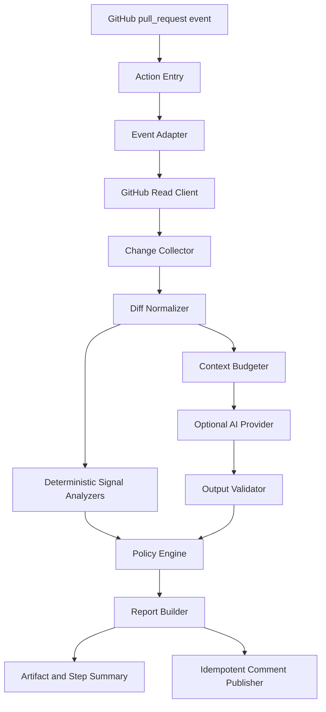

# 03. Architecture

## 1. 总体架构



## 2. 运行模式

### 2.1 GitHub Action 模式

GitHub Action 负责触发和提供运行环境。Go 程序负责实际业务逻辑，建议以稳定 CLI 入口运行：

```text
go-risk-analyzer analyze --event "$GITHUB_EVENT_PATH" --output "$RUNNER_TEMP/report"
```

CLI 应同时支持本地离线输入，便于测试和复现：

```text
go-risk-analyzer analyze --event ./event.json --diff ./change.patch --mode offline
```

### 2.2 未来 App 模式

未来如果需要跨仓库安装、历史数据、异步队列或组织级配置，只增加 GitHub App/Webhook 适配层，不改变 `ChangeSet`、`RiskSignal`、`RiskReport` 和 `Policy` 核心对象。

## 3. 模块边界

### `internal/event`

输入 Action event JSON，校验必要字段，生成 `ReviewRequest`。不读取 GitHub API，不做评分。

### `internal/github`

提供接口：

```text
PullRequestReader
  GetPullRequest(ctx, repository, number)
  ListFiles(ctx, repository, number)
  ListComments(ctx, repository, number)

CommentWriter
  CreateComment(ctx, repository, number, body)
  UpdateComment(ctx, repository, commentID, body)
```

适配器负责分页、速率限制、重试、取消和 GitHub 错误映射。

### `internal/change`

把 GitHub 文件响应和 unified diff 转为领域层 `ChangeSet`。处理：

- added、modified、deleted、renamed、copied。
- 二进制文件和无 patch。
- patch 截断和超过预算的文件。
- 新旧路径、行号、增删行数。
- 文件名大小写和路径规范化。

### `internal/signals`

规则是纯函数或只依赖显式输入的分析器：

```text
Analyzer.Analyze(ctx, ChangeSet) []RiskSignal
```

分析器不调用模型、不发布评论、不修改文件。

### `internal/context`

按预算组装 `ReviewContext`：

1. PR 标题和正文，放入不可信数据区。
2. 变更摘要和确定性信号。
3. 受限 patch。
4. 允许的仓库规则文件。
5. 可选的相关上下文。

超出预算时按优先级裁剪，并记录 `context_truncated`。

### `internal/ai`

定义模型无关接口：

```text
Provider.Analyze(ctx, ReviewContext) (ModelReview, error)
```

Provider 不拥有 GitHub 客户端，不执行工具，不决定最终分数。

### `internal/policy`

输入确定性信号和经过校验的模型候选，输出带风险级别和分数的 `RiskReport`。所有分数和门禁决策在这里产生。

### `internal/report`

把 `RiskReport` 渲染为 JSON、Markdown 和 GitHub Step Summary。渲染器不改变报告语义。

### `internal/publish`

只负责 Artifact、Step Summary 和评论发布。发布失败通过状态和降级原因反映，不修改已经生成的报告。

## 4. 依赖方向

```text
adapters → application → domain

GitHub adapter ─┐
AI adapter ─────┼→ application services → domain model
CLI/Action ────┘
```

领域包不得依赖 GitHub SDK、具体模型 SDK、环境变量或日志全局变量。外部系统通过接口注入。

## 5. 一次分析的生命周期

1. 解析事件并锁定 `repository`、PR number、base SHA、head SHA。
2. 读取 PR 元数据和文件列表。
3. 校验响应是否属于预期 Pull Request 和 head SHA。
4. 规范化文件状态和 patch。
5. 运行确定性分析器。
6. 根据仓库配置和运行模式决定是否调用模型。
7. 校验模型候选的路径、行号、严重级别、证据和数量。
8. 合并信号、应用缓解项并计算分数。
9. 构建不可变报告。
10. 写入 Artifact 和 Step Summary。
11. 在权限允许时按 marker 创建或更新评论。

## 6. 有界策略

建议默认配置：

- 最大文件数：300。
- 最大单文件 patch：128 KiB。
- 最大总 patch：1 MiB。
- 最大模型上下文：由 Provider 预算配置，默认 32k token。
- 最大 findings：20。
- 最大行级候选：10，MVP 不发布行级评论。
- 最大评论正文：60 KiB，超出时只保留摘要并链接 Artifact。
- GitHub API 重试：最多 3 次，只对 429、502、503、504 和网络暂时错误重试。
- 模型修复调用：最多 1 次，不递归重试。

超过上限必须输出显式降级原因，不得静默丢弃关键事实。